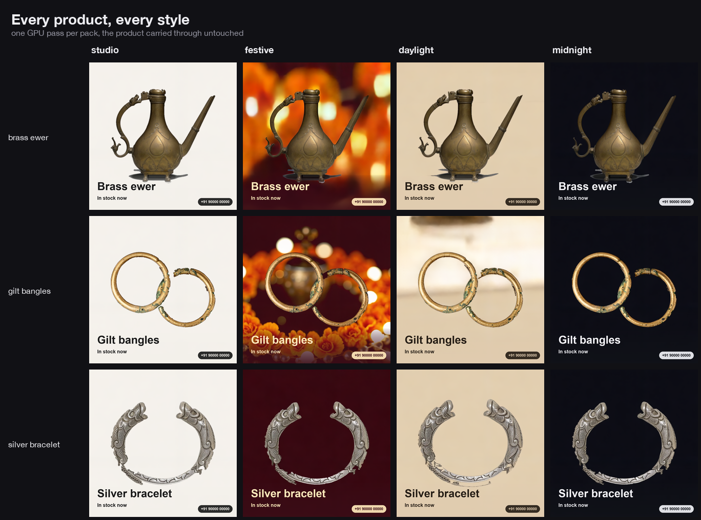
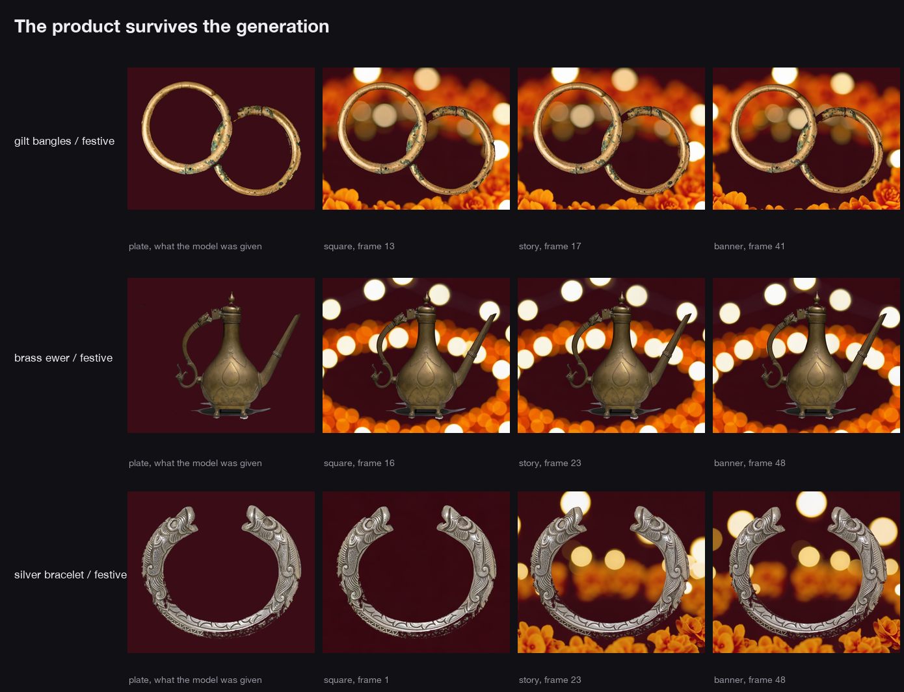

# Dukaan

Dukaan turns one product photo into three still-image advertising creatives.
It removes a reasonably plain background on the CPU, asks LTX-2.3 on an AMD
Radeon GPU for a sequence of candidate frames, selects one frame per layout,
and composites the seller's text after inference.

The supported customer-facing outputs are PNG stills:

| Output | Size | Intended use |
|---|---:|---|
| `square` | 1024 x 1024 | feed post |
| `story` | 1024 x 1820 | vertical story |
| `banner` | 1820 x 1024 | shop header |

Dukaan does not claim a publish-ready moving-media deliverable. By default the
implementation also saves the candidate frame PNGs, an animated GIF preview,
an optional WAV returned by the Radeon runner, the input plate, and a JSON
manifest. Those files support inspection and relabelling; they are not listed
as finished seller outputs. `--no-clip` skips the frame, GIF, and WAV artifacts.

The GPU backend is invoked once per pack, not once per output format. The
headline, subline, and contact text are rendered by Pillow after inference, so
they are not generated inside the scene.


## Hackathon walkthrough

[](https://youtu.be/4kx8gJkY6z8)

**[YouTube: Dukaan hackathon walkthrough, 4 min 31 sec](https://youtu.be/4kx8gJkY6z8)**

This is the required submission recording of the tool and its Radeon workflow.
It is not an output that Dukaan generates for a seller.

## What is demonstrated, and what is not

The committed gallery contains examples from the submitted Radeon runs:



The comparison below was used for visual inspection during development. It is
not a quantitative identity test:



The current boundaries are important:

- LTX-2.3 can change product shape, texture, engraving, logos, colour, pose, or
  surrounding objects. Dukaan does not guarantee product identity or
  pixel-level fidelity. A person must review every generated creative before
  publishing it.
- The automatic selector spreads picks across the candidate sequence and uses
  Laplacian variance as a sharpness score. It does not compare a candidate to
  the source product and cannot reject identity drift.
- The CPU cutout is designed for products against reasonably plain or smoothly
  graded backgrounds. Clutter, strong vignettes behind the object, transparent
  materials, reflections, fine hair-like detail, and low foreground/background
  contrast can produce a poor mask.
- The CPU mock is a deterministic zoom of the input plate. It verifies file
  writing, layout, selection, and command flow only. It is not evidence of
  model quality, Radeon compatibility, or Radeon performance.
- `--product` is used as the output directory name. Use a filesystem-safe name
  and do not pass untrusted path text.
- The Radeon runner assumes a prepared LTX-2.3 ComfyUI environment and the
  expected model, LoRA, and upscaler files. It does not provision a Radeon
  instance or download model weights from scratch.

## Install

Python 3.10 or newer is required.

```bash
python -m venv .venv
.venv/bin/pip install -e '.[dev]'
```

Runtime dependencies are declared in `pyproject.toml`: Pillow, NumPy,
Requests, websocket-client, Typer, and Rich. `pytest` is the optional `dev`
dependency. Gradio is the optional `web` dependency.

For the browser UI:

```bash
.venv/bin/pip install -e '.[web]'
.venv/bin/dukaan serve
```

The browser UI and CLI call the same `build_pack` pipeline.

## Try the still-image pipeline without a GPU

With no `DUKAAN_INSTANCE`, Dukaan deliberately selects the mock backend:

```bash
.venv/bin/dukaan doctor
.venv/bin/dukaan pack examples/brass-ewer.png \
  --headline "Handmade brass ewer" \
  --subline "1,450 rupees, free delivery in the city" \
  --style festive \
  --contact "@your-shop" \
  --no-clip
```

That command writes a plate, a manifest, and three PNG creatives under
`out/brass-ewer/`. The pictures are layout previews made from the input plate,
not generated Radeon results.

## Run on the prepared Radeon instance

No separate Radeon API key is used by this repository. `DUKAAN_INSTANCE` is the
JupyterLab base URL supplied for the prepared instance. On the environment used
for this submission, the URL itself grants access, so treat it as a credential
and do not commit it or paste it into logs.

```bash
export DUKAAN_INSTANCE=https://<host>/instances/<instance-id>
.venv/bin/dukaan deploy
.venv/bin/dukaan doctor
.venv/bin/dukaan pack examples/brass-ewer.png \
  --headline "Handmade brass ewer" \
  --subline "1,450 rupees, free delivery in the city" \
  --style festive \
  --contact "@your-shop" \
  --no-clip
```

`deploy` copies `scripts/radeon_ltx.py` to the instance's persistent workspace.
`doctor` checks connectivity, reports the detected environment, and confirms
that the runner is present. A configured Radeon failure is surfaced as an
error; it is not silently replaced with mock output.

Environment variables:

| Variable | Default | Meaning |
|---|---|---|
| `DUKAAN_INSTANCE` | empty | JupyterLab base URL; empty selects the mock |
| `DUKAAN_REMOTE_DIR` | `dukaan` | persistent remote working directory |
| `DUKAAN_OUT` | `out` | local output directory |
| `DUKAAN_WIDTH` | `768` | generation width |
| `DUKAAN_HEIGHT` | `768` | generation height |
| `DUKAAN_FRAMES` | `49` | candidate frame count |
| `DUKAAN_FPS` | `25` | GIF preview timing and runner frame rate |
| `DUKAAN_SEED` | `7` | inference seed |
| `DUKAAN_STRENGTH` | `0.7` | image conditioning strength |
| `DUKAAN_REFINE` | empty | enable the optional second pass with `1`, `true`, or `yes` |
| `DUKAAN_JOB_TIMEOUT` | `1800` | remote job timeout in seconds |

The remote script defaults to `COMFY_ROOT=/comfyui_workspace/ComfyUI` and the
model filenames embedded in `scripts/radeon_ltx.py`. If the instance layout or
model names differ, the runner must be adapted before `deploy`.

## Other commands

```bash
# List styles and fixed output formats
.venv/bin/dukaan styles

# Process a folder with one batched backend call
.venv/bin/dukaan catalogue ~/photos \
  --style studio --contact "@your-shop" --no-clip

# Recompose text without a backend call
.venv/bin/dukaan relabel out/brass-ewer \
  --subline "Diwali price, 1,199 rupees"

# Re-run the Radeon benchmark matrix and write JSON
.venv/bin/dukaan bench examples/brass-ewer.png
```

Relabelling needs the saved candidate frames. A pack created with `--no-clip`
does not retain them, so it cannot be relabelled later without another pack
run. `catalogue` derives each headline from its filename and shares the Radeon
model loads across the batch.

## Pipeline

```text
photo
  -> CPU background fit and cutout
  -> product plate on the selected style colour
  -> one backend render
  -> candidate frames
  -> spread plus sharpness selection
  -> fit each selected frame to a fixed layout by reflection
  -> composite seller text
  -> square, story, and banner PNGs
```

Four style presets are defined in `dukaan/spec.py`: `studio`, `festive`,
`daylight`, and `midnight`. They are fixed prompt and colour configurations,
not user-trained styles.

Frame 0 is excluded from normal selection because it is the conditioning plate.
The remaining frames are divided into one window per requested format, and the
sharpest frame in each window is selected. This creates temporal spread but
does not assess product fidelity or aesthetic quality.

Seller text is composed after inference. Long headlines are resized to fit,
and the contact strip is optional. Reshaping preserves the whole selected frame
and fills extra bands by reflection rather than cropping the sides.

## Recorded Radeon evidence

`bench-results/radeon-ltx.json` contains the committed measurements from the
development instance. They are historical submission evidence, not a fresh
run on the reader's hardware and not a performance guarantee.

| Recorded request | GPU seconds | Wall seconds | Peak container RAM |
|---|---:|---:|---:|
| 512 x 512, 25 frames | 45.5 | 125.9 | 49.8 GB |
| 768 x 768, 25 frames | 54.6 | 124.3 | 49.9 GB |
| 768 x 768, 49 frames | 70.7 | 140.0 | 49.9 GB |
| 768 x 768, 49 frames, refined to 1536 | 176.1 | 270.9 | 49.9 GB |

The committed batching record reports 134.3 GPU seconds for three products.
Its 212.1-second independent-run comparison is calculated as three times the
70.7-second single-product row; it is an estimate, not three separately timed
runs. See the JSON for the full fields and `docs/profile.md` for the development
notes behind the memory adaptation.

On that instance, the development notes recorded an approximately 43 GB
checkpoint and 23 GB text encoder inside a 55 GB container. The runner loads
them in separate processes and saves conditioning between phases. This is a
workaround for that measured environment, not a claim that every Radeon or
every ComfyUI installation has the same limit.

## Tests

```bash
.venv/bin/python -m pytest tests/ -q
```

The CPU suite covers cutout behavior on synthetic flat and graded backgrounds,
layout sizing, frame spread and sharpness selection, reflection-based fitting,
manifest and file creation, format subsets, one backend call per pack, and
GPU-free relabelling.

It does not run LTX-2.3, contact a Radeon instance, verify the committed gallery,
measure product identity, validate the historical benchmark, or prove quality
on arbitrary phone photos. Those claims should not be inferred from a passing
CPU test run.

## Repository layout

```text
dukaan/
  backend.py    CPU mock, cutout, and Radeon backend
  cli.py        command-line and browser entry points
  config.py     environment configuration
  frames.py     candidate selection and reshaping
  instance.py   JupyterLab transport
  layout.py     post-inference text composition
  pack.py       pack and catalogue pipelines
  spec.py       styles and output formats
scripts/
  radeon_ltx.py remote two-phase LTX runner
```

## Licence and example images

The code is Apache-2.0. The example photographs are third-party CC0 works and
are listed with their sources in [examples/CREDITS.md](examples/CREDITS.md).
