# Gallery

Every image below came out of one `dukaan pack` run against a Radeon PRO
(gfx1100, 48 GB) through ROCm, generated at **1536x1536** with the refine
pass on, so the stills are downscaled into their formats rather than
stretched up. Each row is a single GPU pass: one clip, and
three stills lifted from three different moments of it.

The input photographs are CC0 museum object shots, credited in
[../examples/CREDITS.md](../examples/CREDITS.md). Nothing in the product itself
is generated: the model lights a scene around a cutout it is told not to change,
and the type is composited afterwards.

---

## One photo, four looks

The same photograph under every style Dukaan ships. Only the style name changed
between these four runs; the ewer is identical in all of them, which is the
point. A seller cannot post a picture of a thing they will not ship.

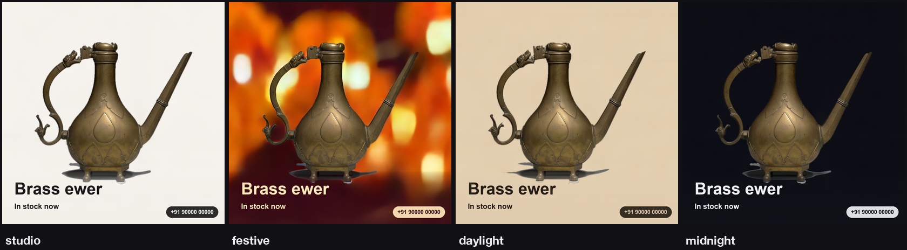

---

## Handmade brass ewer, festive

Plate the model was given, then the three creatives.

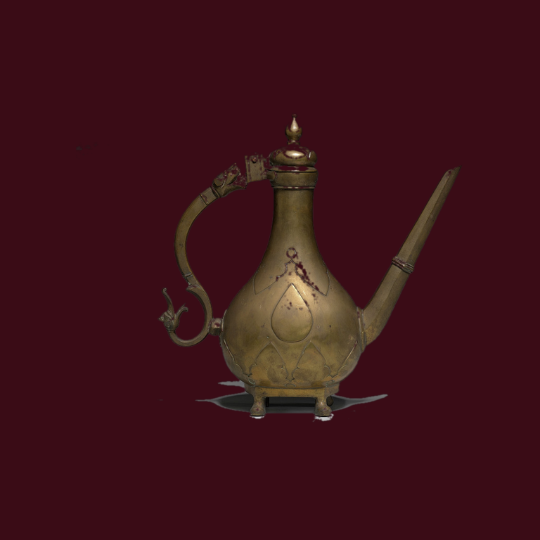

| square, frame 16 | story, frame 20 | banner, frame 48 |
|---|---|---|
| 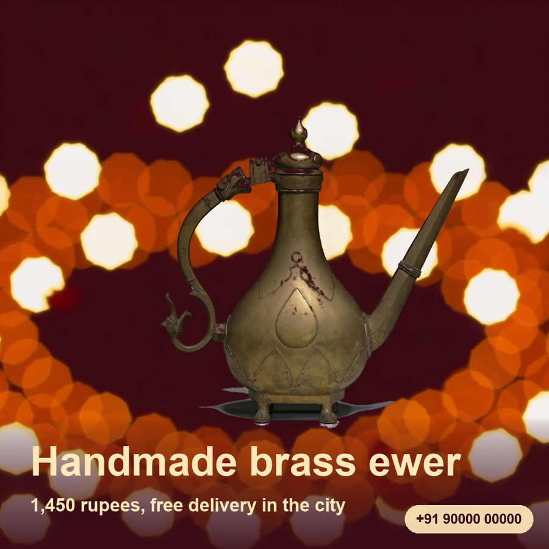 | 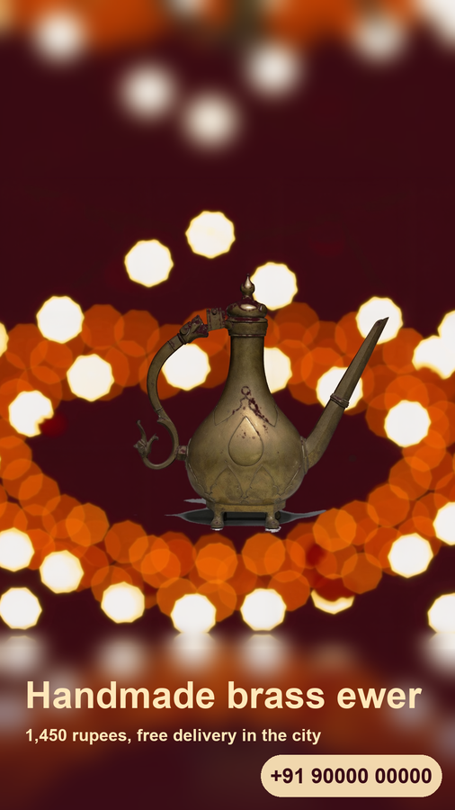 | 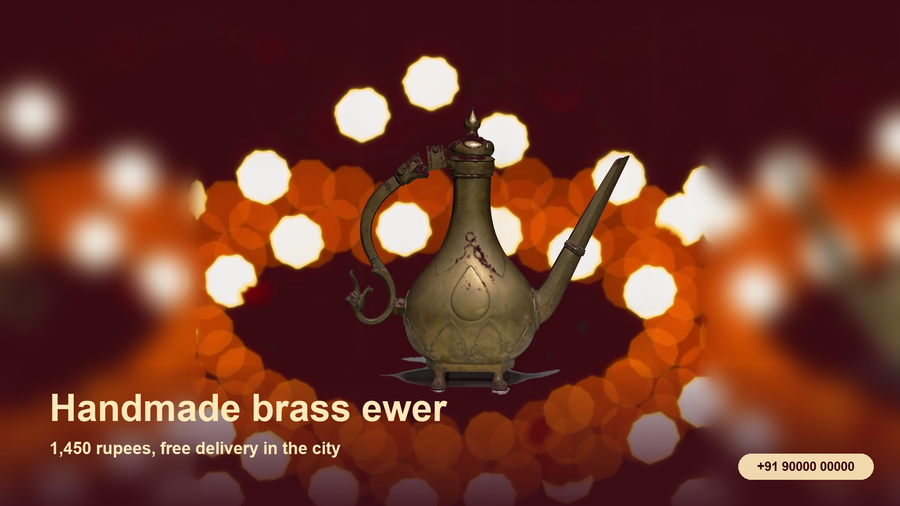 |

65.3 s of GPU time. The banner is the case that drove the reflection fix:
stretching the edge column instead drew the bokeh into horizontal streaks.

---

## Hand-worked silver bangle, studio

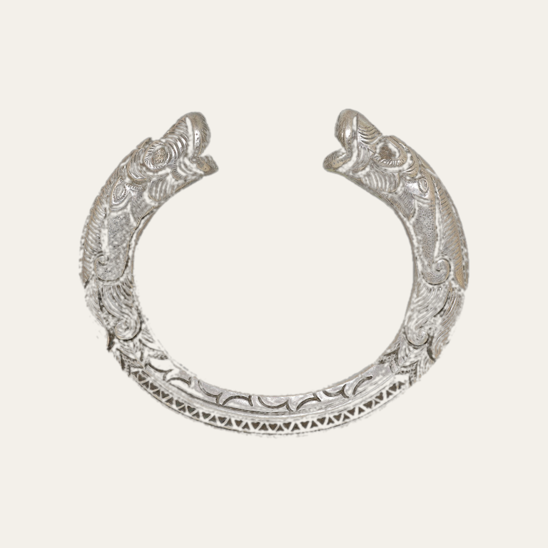

| square, frame 13 | story, frame 21 | banner, frame 48 |
|---|---|---|
| 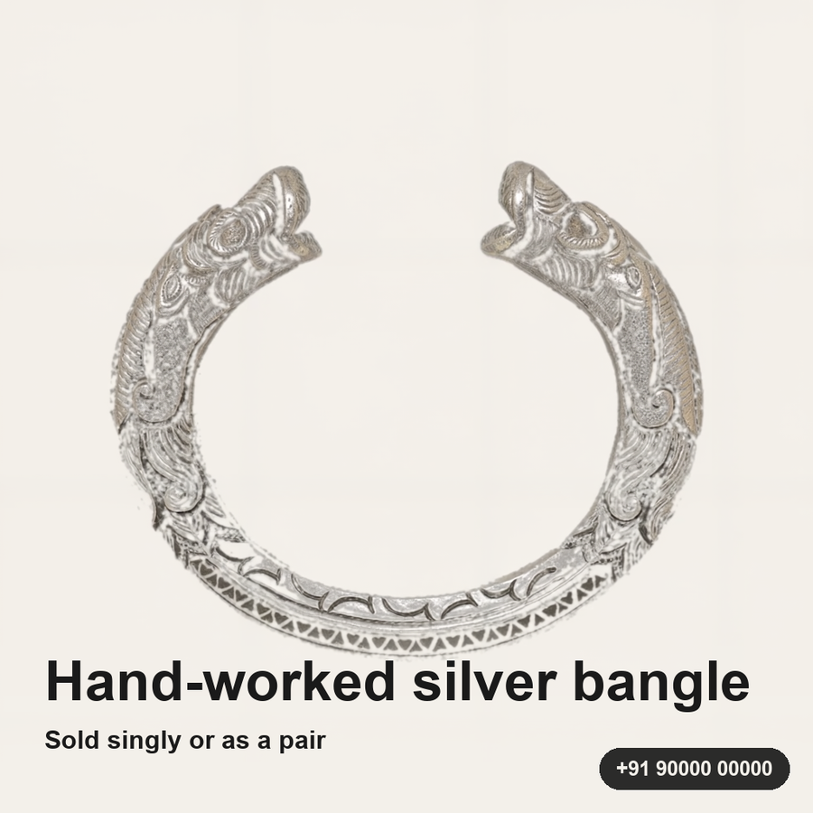 | 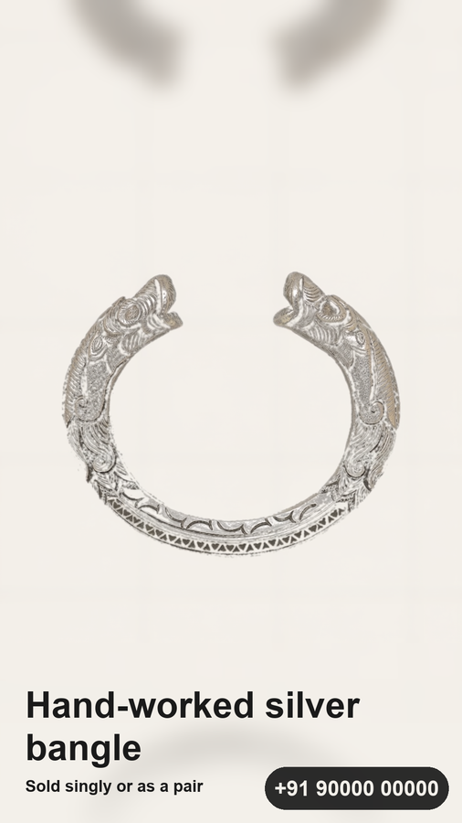 |  |

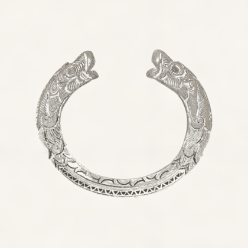

72.6 s of GPU time. The bangle's engraving survives the pass intact, which is
the thing that matters: a seller cannot ship a creative where the model has
redesigned the product.

---

## Blue-and-white porcelain vase, midnight

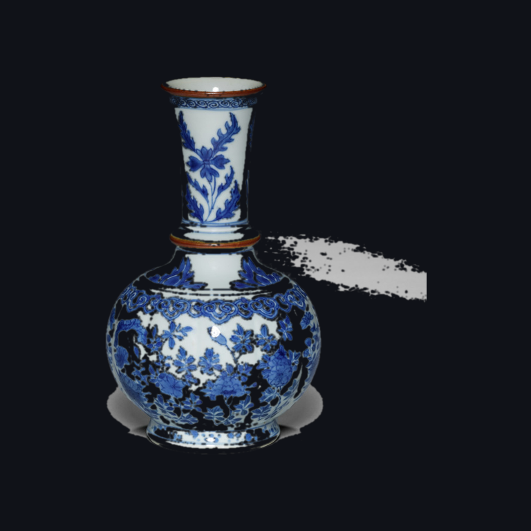

| square, frame 1 | story, frame 29 | banner, frame 33 |
|---|---|---|
| 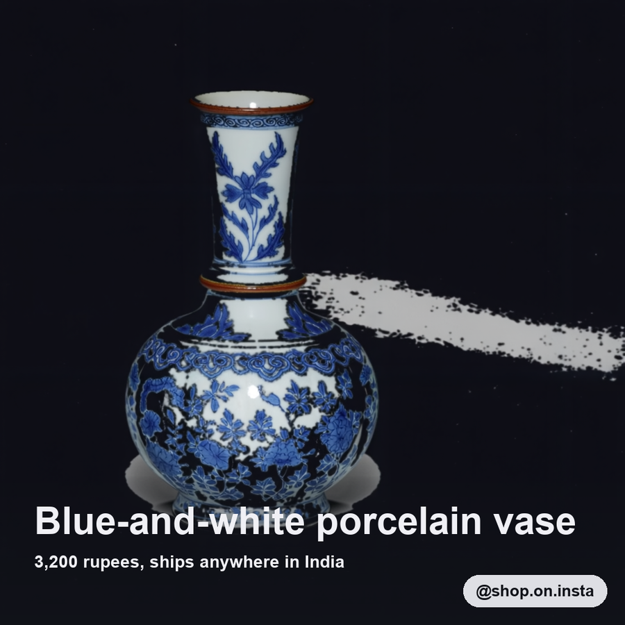 | 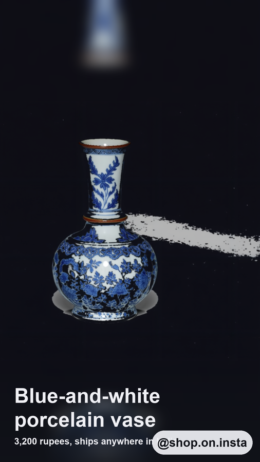 | 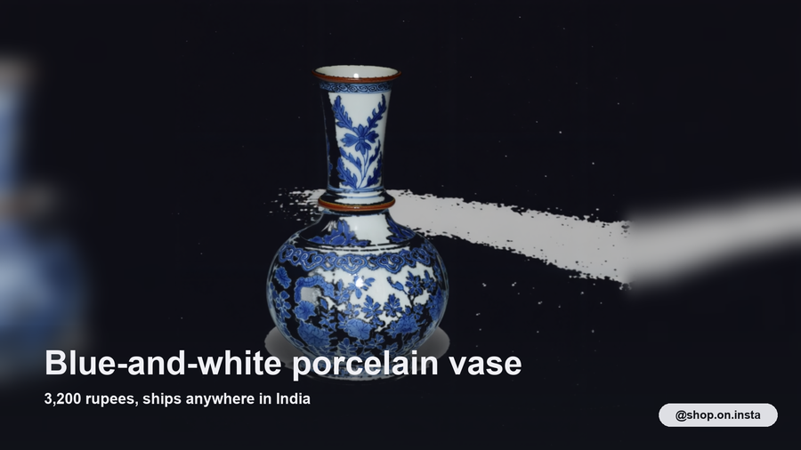 |

62.0 s of GPU time. The square landed on frame 1 here: the model settles almost
immediately on a dark ground, so the sharpest frame in the first window is an
early one.

---

## What the numbers were

| product | style | GPU | wall clock | frames | stills from |
|---|---|---|---|---|---|
| brass ewer | festive | 65.3 s | 2 m 20 s | 49 | 16, 20, 48 |
| silver bangle | studio | 72.6 s | 2 m 19 s | 49 | 13, 21, 48 |
| gilt bangles | midnight | 62.0 s | n/a (batched) | 49 | 1, 29, 33 |

Wall clock includes the plate upload, both model loads and pulling 49 frames
plus a wav back over the tunnel. Before frames were fetched as one tar it was
3 m 34 s.
